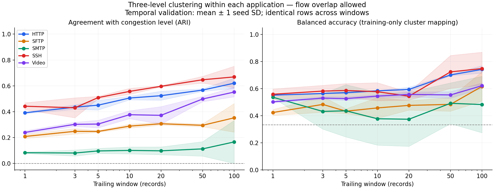
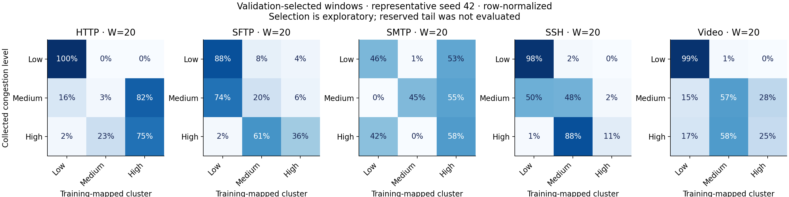

# بررسی خوشه‌بندی سه سطح ازدحام به‌تفکیک برچسب

داده‌های همین شاخه، در مسیر `DATASETS/CDR-MLC/New_Version/` استفاده شدند:
۱۵ فایل، پنج برچسب × سه سطح. نسخهٔ داده:
`89e221d1a40ea0ee2d95e5f846e74c9e996fa9fd`.
پس از فیلتر endpointهای سرویس، ۱۰۶٬۵۱۲ رکورد باقی ماند. فایل‌های داده تغییر نکردند.

## نتیجهٔ اصلی

پنجره‌های **۱، ۳، ۵، ۱۰، ۲۰، ۵۰ و ۱۰۰ رکورد** با پنج seed
`0, 21, 42, 84, 123` بررسی شدند. برای هر برچسب، MiniBatchKMeans با سه خوشه
روی ترکیب هر سه سطح آموزش داده شد. فقط پنج آمارهٔ سه ویژگی
`TcpRtt, SynAck, AckDat` ورودی مدل هستند؛ برچسب و سطح ازدحام وارد مدل نمی‌شوند.

شاخص اصلی **ARI** است: ۱ یعنی توافق کامل با سطح واقعی؛ مقدار نزدیک صفر یعنی
توافق در حد تصادف. ARI دقت طبقه‌بندی ترافیک نیست.

| برچسب | ARI پنجرهٔ ۳ | ARI پنجرهٔ ۱۰۰ | انحراف معیار بین seedها، پنجرهٔ ۱۰۰ |
|---|---:|---:|---:|
| HTTP | 0.4354 | 0.6203 | 0.0398 |
| SFTP | 0.2483 | 0.3526 | 0.1106 |
| SMTP | 0.0806 | 0.1661 | 0.1659 |
| SSH | 0.4303 | 0.6689 | 0.0825 |
| Video | 0.3024 | 0.5518 | 0.0369 |

این جدول مربوط به **اعتبارسنجی زمانی درون capture، با امکان اشتراک اتصال TCP
بین بخش‌ها** است. آن را تعمیم به اتصال یا capture مستقل ندانید.
پنجرهٔ ۱۰۰ در تمام برچسب‌ها بالاترین *میانگین* ARI در محدودهٔ آزمایش را دارد؛
این به معنی بهینه‌بودن قطعی ۱۰۰ یا لزوم تغییر پنجرهٔ مقاله نیست. بهترین مقدار
در مرز بالایی جست‌وجو قرار دارد و روی آزمون نهایی مستقل تأیید نشده است.

SMTP حتی با پنجرهٔ بزرگ، تفکیک ضعیف و حساسیت شدید به مقداردهی اولیه دارد.
HTTP و SSH بهبود محسوس دارند، اما سه سطح هنوز کاملاً جدا نیستند.
برای SFTP هم پایداری به seed محدود است. استانداردسازی و پنج آمارِ زمان‌بندی
لزومأ سه سطح فیزیکی را به سه گروه کروی مناسب K-means تبدیل نمی‌کنند.



## بررسی سخت‌گیرانهٔ اتصال‌های مشترک

برای کاهش وابستگی رکوردهای یک اتصال در آموزش و اعتبارسنجی، آزمایش دوم
five-tupleهای مشترک با بخش‌های بعدی را از بخش قبلی حذف می‌کند. حذف براساس
شناسهٔ اتصال است، نه مقدار ویژگی یا نتیجهٔ مدل. پنجره‌ها از روی شکاف حذف‌ها
عبور نمی‌کنند؛ رکوردهای دو طرف شکاف به هم چسبانده نمی‌شوند.

این حذف محافظه‌کارانه است: استفادهٔ دوباره از پورت موقتی در اتصال‌های مستقل
ممکن است به‌اشتباه مشترک شمرده شود؛ خروجی Argus شناسهٔ یکتای سشن تضمین‌شده ندارد.
برای پنجره‌های ۵۰/۱۰۰ در همهٔ برچسب‌ها دادهٔ پیوستهٔ کافی نماند. برای مثال
HTTP-Low در آموزش برای W=50 فقط ۸ پنجره، و برای W=100 هیچ پنجره‌ای ندارد.
پس مقایسهٔ سخت‌گیرانه برای **۱، ۳، ۵، ۱۰، ۲۰** اجرا شد.

| برچسب | ARI پنجرهٔ ۳ | ARI پنجرهٔ ۲۰ |
|---|---:|---:|
| HTTP | 0.2212 | 0.2368 |
| SFTP | 0.2389 | 0.3142 |
| SMTP | 0.1111 | 0.1133 |
| SSH | 0.3934 | 0.5554 |
| Video | 0.2703 | 0.4170 |

این جدول روی زیرمجموعهٔ متفاوتی از رکوردهاست؛ اختلاف عددی بین دو جدول را
نمی‌توان صرفاً اثر حذف نشت یا اثر پنجره دانست. **داخل هر جدول**، نمونه‌های
آموزش/اعتبارسنجی بین همهٔ پنجره‌ها دقیقاً یکسان‌اند. پنجرهٔ ۲۰ در میان پنج
گزینهٔ آزمایش سخت‌گیرانه بیشترین میانگین ARI را داشت؛ افزایش SMTP بسیار کم بود.



## پروتکل قابل بازتولید

- هر capture براساس `StartTime` مرتب می‌شود؛ ترتیب مساوی‌ها با شمارهٔ سطر ثابت می‌ماند.
- ۶۰٪ ابتدایی آموزش، ۲۰٪ بعدی اعتبارسنجی و ۲۰٪ نهایی رزرو است؛ بخش رزرو امتیازدهی نشده است.
- پنجره در مرز فایل، بخش زمانی و رکورد نامعتبر از نو شروع می‌شود؛ فقط پنجرهٔ کامل معتبر است.
- میانگین، بیشینه، میانه، کمینه و انحراف معیار جمعیت (`ddof=0`)، مجموعاً ۱۵ ویژگی؛ زمان‌بندی صفر حذف نمی‌شود.
- برای مقایسهٔ منصفانه، نقاط انتهایی مشترک لازم برای بزرگ‌ترین W هر پروتکل انتخاب می‌شوند.
- StandardScaler فقط روی آموزش همان برچسب/پنجره fit می‌شود.
- MBK: `k=3, batch_size=1024, n_init=10, max_iter=100, reassignment_ratio=0.01`؛ با شاخهٔ فعلی سازگار است.
- ARI، AMI، Silhouette و balanced accuracy گزارش می‌شوند. نگاشت یک‌به‌یک خوشه به سطح با Hungarian و فقط روی آموزش ثابت می‌شود؛ اعتبارسنجی نگاشت را تغییر نمی‌دهد.
- Silhouette بر ۱۰۰۰ ردیف ثابت نمونه‌برداری‌شده ارزیابی می‌شود. از Silhouette برای نام‌گذاری سطح یا انتخاب W استفاده نشده است.
- انحراف معیار گزارش‌شده فقط تغییرپذیری بین seedهاست؛ فاصلهٔ اطمینان آماری نیست.

برای هر برچسب تنها یک capture در هر سطح داریم؛ سطح و شرایط همان اجرای capture
با هم آمیخته‌اند. این بررسی *تشخیصی و مشروط به دانستن برچسب* است، نه روتر
قابل استفاده با برچسب ناشناخته و نه اثبات علت‌بودن ازدحام. بخش‌های رزرو همین
captureها در کارهای قبلی استفاده شده‌اند؛ آنها یک آزمون کاملاً بکر جهانی نیستند.

پنجرهٔ ۱۰۰ به معنی ۱۰۰ ثانیه نیست: میانهٔ مدت آن در بخش اعتبارسنجی، بسته به
سرویس/سطح، حدود **۷۸ تا ۲۴۹ ثانیه** است. جدول کامل در `window_time_spans.csv`
ذخیره شده است. این هموارسازی می‌تواند تغییر سریع ازدحام را پنهان کند؛ این داده‌ها
گذار بین سطح‌ها در یک capture را نمی‌آزمایند.

## اجرا

از ریشهٔ مخزن:

```bash
python -m pip install -r CDR_MLC/requirements-window-sweep.txt
python -m unittest discover -s CDR_MLC/tests -p test_window_sweep.py -v
python CDR_MLC/window_sweep.py --audit-eligibility-only --output CDR_MLC/outputs/window_sweep
python CDR_MLC/window_sweep.py --purge-mode none --output CDR_MLC/outputs/window_sweep/temporal
python CDR_MLC/window_sweep.py --purge-mode five-tuple --windows 1 3 5 10 20 --output CDR_MLC/outputs/window_sweep/purged
```

یا نوت‌بوک `CDR-MLC-Window-Sweep.ipynb` را Run All کنید.
۸ تست، محاسبات پنجره، نبود استفاده از آینده، مرز بخش‌ها، عدم عبور از شکاف حذف،
برابری نقاط مقایسه، نگاشت بدون برچسب اعتبارسنجی و نبود متادیتا در ویژگی‌ها را بررسی می‌کنند.

خروجی‌های ذخیره‌شده در `analysis_reports/window_sweep_20260918/`:

- `temporal/` و `purged/`: گزارش، نمودار و خلاصهٔ همهٔ پنجره‌ها.
- `metrics_by_seed.csv`: همهٔ ۳۰۰ اجرای مدل، جدا برای آموزش و اعتبارسنجی.
- `contingency_by_seed.csv`: ترکیب واقعی سه سطح در هر خوشه و هر seed.
- `input_audit.csv`، `split_audit.csv` و `run_config.json`: منشأ داده، hashها، حذف‌ها، پارامترها و نسخهٔ کتابخانه‌ها.
- `purged_eligibility_all_windows.csv`: تعداد پنجره‌های باقی‌مانده پس از حذف محافظه‌کارانه، برای هر هفت W.
- `common_endpoints.csv` هنگام اجرا تولید می‌شود؛ فایل حجیم و قابل بازتولید آن در Git ثبت نشده است. SHA-256 آن در `artifact_manifest.json` ثبت شده است.

تعداد اجراها: ۵ برچسب × ۷ پنجره × ۵ seed = ۱۷۵، و بررسی سخت‌گیرانه
۵ × ۵ × ۵ = ۱۲۵؛ مجموعاً **۳۰۰ fit مستقل**. کد هیچ داده‌ای را جابه‌جا یا
oversample نکرده و عددی از مقاله را به عنوان نتیجهٔ این اجراها استفاده نکرده است.
