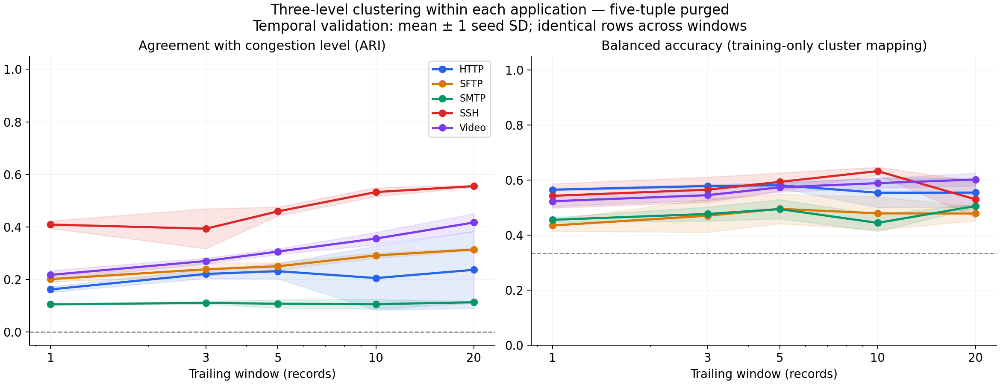

# Per-application congestion clustering: window sweep

Source dataset commit: `89e221d1a40ea0ee2d95e5f846e74c9e996fa9fd`.
Protocol: **five-tuple**. 106,512 service records from 106,512 raw records, 15 captures.

Exploratory diagnostic: true application identity defines five separate analyses. Three levels are present in training and validation for each application.

## Mean validation ARI by window

| Window | HTTP | SFTP | SMTP | SSH | Video |
|---|---:|---:|---:|---:|---:|
| 1 | 0.1623 | 0.2014 | 0.1053 | 0.4091 | 0.2176 |
| 3 | 0.2212 | 0.2389 | 0.1111 | 0.3934 | 0.2703 |
| 5 | 0.2317 | 0.2503 | 0.1077 | 0.4594 | 0.3063 |
| 10 | 0.2055 | 0.2915 | 0.1062 | 0.5328 | 0.3559 |
| 20 | 0.2368 | 0.3142 | 0.1133 | 0.5554 | 0.4170 |

## Exploratory best windows

| Application | Window | W=3 ARI | Selected ARI ± seed SD | AMI | Mapped balanced accuracy |
|---|---:|---:|---:|---:|---:|
| HTTP | 20 | 0.2212 | 0.2368 ± 0.1459 | 0.3451 | 0.5545 |
| SFTP | 20 | 0.2389 | 0.3142 ± 0.0045 | 0.3409 | 0.4784 |
| SMTP | 20 | 0.1111 | 0.1133 ± 0.0040 | 0.2513 | 0.5055 |
| SSH | 20 | 0.3934 | 0.5554 ± 0.0040 | 0.5242 | 0.5297 |
| Video | 20 | 0.2703 | 0.4170 ± 0.0340 | 0.3742 | 0.6019 |

## Protocol

- First 60% / next 20% / final 20% of each timestamp-sorted capture; final tail not evaluated.
- Training excludes tuples in validation/reserved; validation excludes reserved tuples; gaps invalidate windows
- Common endpoints require 20 consecutive eligible rows. Every W uses exactly the same training/validation endpoints.
- Five statistics (mean, max, median, min, population std) for TcpRtt, SynAck, AckDat. Zeros retained; invalid values break windows.
- StandardScaler and MBK fit on training only. No application/congestion labels are model inputs.
- Primary metric: ARI. AMI and silhouette also reported. Balanced accuracy uses a one-to-one mapping frozen from training only.
- Best W maximizes mean validation ARI; the reserved partition is not used to verify that selection.
- Hyperparameters, SHA-256 hashes, sample counts, exclusions and window spans are in companion CSV/JSON files.

## Limits

- Conservative tuple purge can also remove distinct connections reusing an ephemeral port; surviving windows form a selected subset.
- Only one capture per application/level: level is confounded with run conditions.
- Application identity conditions this diagnostic; do not use unknown labels to route deployment.
- Reserved tail not scored; these captures have prior exploratory use and are not globally pristine.
- Overlapping windows are dependent; seed std is optimizer variability, not statistical confidence.
- Row-count windows have different time spans across applications/captures.
- No cross-level boundary transitions tested; windows reset at capture boundaries.

Full instructions: [WINDOW_SWEEP.md](../../../WINDOW_SWEEP.md).
