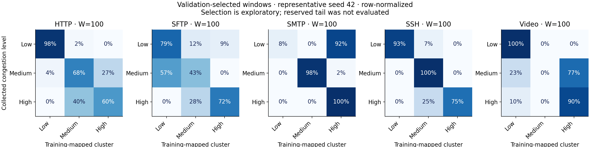

# Per-application congestion clustering: window sweep

Source dataset commit: `89e221d1a40ea0ee2d95e5f846e74c9e996fa9fd`.
Protocol: **none**. 106,512 service records from 106,512 raw records, 15 captures.

Exploratory diagnostic: true application identity defines five separate analyses. Three levels are present in training and validation for each application.

## Mean validation ARI by window

| Window | HTTP | SFTP | SMTP | SSH | Video |
|---|---:|---:|---:|---:|---:|
| 1 | 0.3915 | 0.2085 | 0.0828 | 0.4424 | 0.2398 |
| 3 | 0.4354 | 0.2483 | 0.0806 | 0.4303 | 0.3024 |
| 5 | 0.4505 | 0.2472 | 0.0966 | 0.5090 | 0.3044 |
| 10 | 0.5057 | 0.2885 | 0.1006 | 0.5570 | 0.3768 |
| 20 | 0.5238 | 0.3068 | 0.0975 | 0.5964 | 0.3719 |
| 50 | 0.5673 | 0.2948 | 0.1125 | 0.6471 | 0.4983 |
| 100 | 0.6203 | 0.3526 | 0.1661 | 0.6689 | 0.5518 |

## Exploratory best windows

| Application | Window | W=3 ARI | Selected ARI ± seed SD | AMI | Mapped balanced accuracy |
|---|---:|---:|---:|---:|---:|
| HTTP | 100 | 0.4354 | 0.6203 ± 0.0398 | 0.5786 | 0.7418 |
| SFTP | 100 | 0.2483 | 0.3526 ± 0.1106 | 0.4093 | 0.6159 |
| SMTP | 100 | 0.0806 | 0.1661 ± 0.1659 | 0.2789 | 0.4823 |
| SSH | 100 | 0.4303 | 0.6689 ± 0.0825 | 0.7008 | 0.7480 |
| Video | 100 | 0.3024 | 0.5518 ± 0.0369 | 0.4872 | 0.6213 |

## Protocol

- First 60% / next 20% / final 20% of each timestamp-sorted capture; final tail not evaluated.
- No tuple purge: within-capture temporal validation permits related TCP records across partitions; not independent-flow generalization
- Common endpoints require 100 consecutive eligible rows. Every W uses exactly the same training/validation endpoints.
- Five statistics (mean, max, median, min, population std) for TcpRtt, SynAck, AckDat. Zeros retained; invalid values break windows.
- StandardScaler and MBK fit on training only. No application/congestion labels are model inputs.
- Primary metric: ARI. AMI and silhouette also reported. Balanced accuracy uses a one-to-one mapping frozen from training only.
- Best W maximizes mean validation ARI; the reserved partition is not used to verify that selection.
- Hyperparameters, SHA-256 hashes, sample counts, exclusions and window spans are in companion CSV/JSON files.

## Limits

- Shared TCP tuples across partitions remain; scores may benefit from within-connection dependence.
- Only one capture per application/level: level is confounded with run conditions.
- Application identity conditions this diagnostic; do not use unknown labels to route deployment.
- Reserved tail not scored; these captures have prior exploratory use and are not globally pristine.
- Overlapping windows are dependent; seed std is optimizer variability, not statistical confidence.
- Row-count windows have different time spans across applications/captures.
- No cross-level boundary transitions tested; windows reset at capture boundaries.

Full instructions: [WINDOW_SWEEP.md](../../../WINDOW_SWEEP.md).
