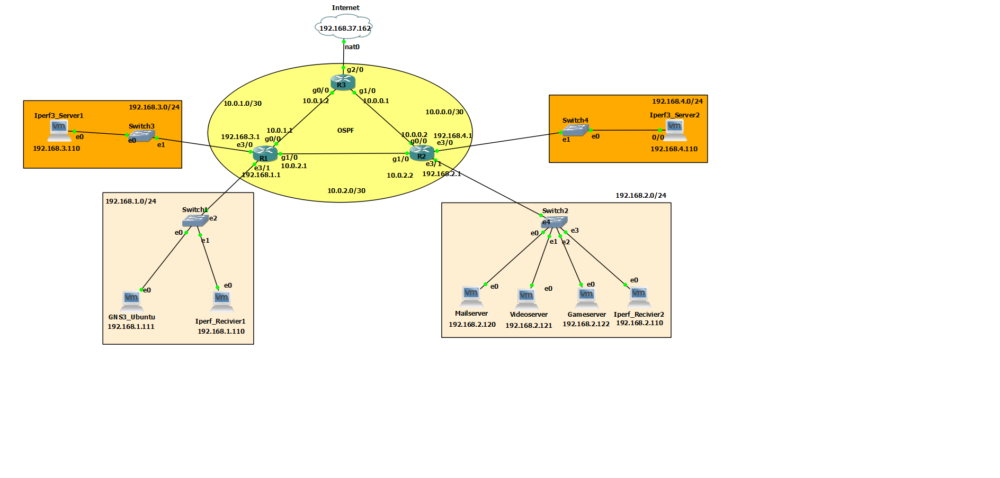

# IUST_MSCN_Dataset

## Introduction
The multiscale computer network dataset (MSCN) is a multiclass traffic at different perturbation levels.
This data set is designed to show different levels of congestion in the network and currently includes 5 different behavior classes: HTTP, VIDEO, SSH, SFTP, SMTP.
GNS3 emulator is used to create and save network traffic (PCAP). The general architecture for building the first version of the dataset is given in the figure below.

## Network Architecture
In the design of the network architecture, host-switch, switch-gateway, and gateway-gateway connections have been implemented. This network consists of four local networks connected to each other through three routers. The iperf tool is used to add overhead to the network. Adding overhead causes congestion, which affects network performance metrics such as delay, jitter, loss, and throughput. These changes vary depending on the volume of load exchanged within the network.

To create different levels of network performance, hosts are used as follows:

    192.168.3.110 -> 192.168.2.110
    192.168.4.110 -> 192.168.1.110

Additionally, to simulate real-world traffic, both the amount of overhead added and the duration for which the overhead is applied by iperf are chosen randomly. To increase the performance level, the minimum overhead generation is incremented.
