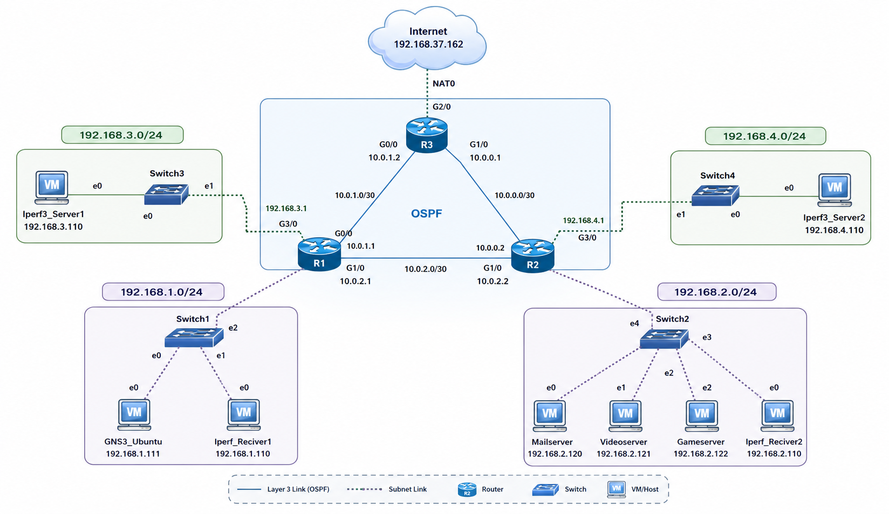
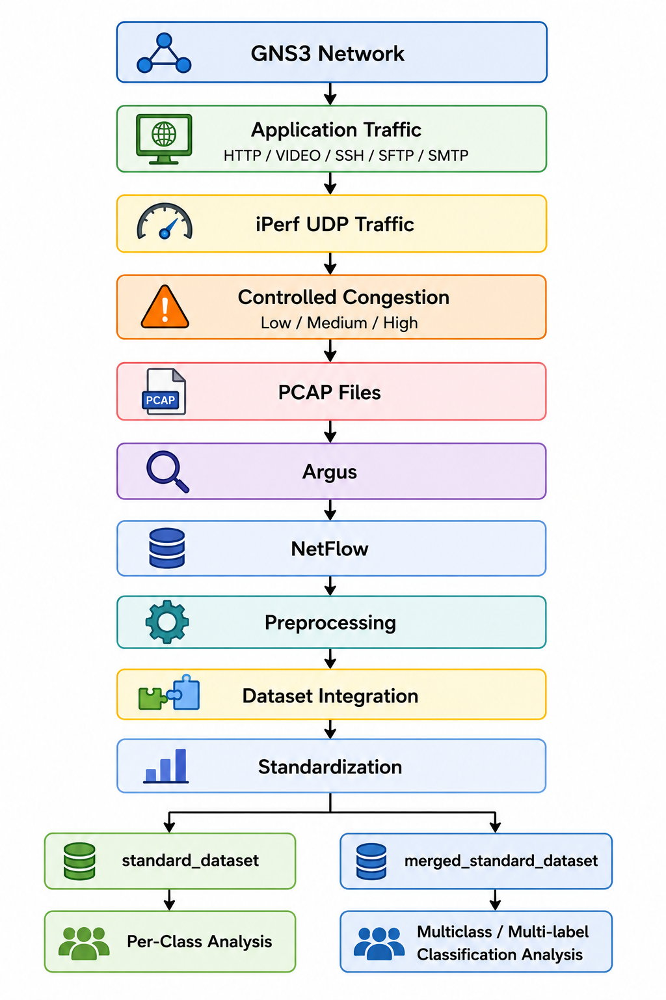

# IUST_MSCN_Dataset


## Introduction

The **Multiscale Computer Network Dataset (MSCN)** is a multiclass network traffic dataset designed to investigate the impact of different levels of network congestion on network traffic characteristics and traffic classification.

The dataset currently contains five traffic classes:

* HTTP
* VIDEO
* SSH
* SFTP
* SMTP

The dataset is generated using the **GNS3 network emulator**, where network traffic is captured as PCAP files under controlled network conditions. Different congestion levels are introduced by generating additional UDP traffic using the **iPerf** tool.

The dataset is designed to investigate how congestion affects network performance and flow-level traffic characteristics, including delay, jitter, packet loss, throughput, and other traffic features. It can also be used to study congestion-induced distribution shifts in network traffic classification.

## Network Architecture

The network consists of four local networks interconnected through three routers. The architecture includes host-to-switch, switch-to-gateway, and gateway-to-gateway connections, forming a multi-hop network path containing switches and routers.



The following communication paths are used to generate application traffic:

```
192.168.3.110 -> 192.168.2.110
192.168.4.110 -> 192.168.1.110
```

The five application traffic classes are generated over these paths:

* HTTP
* VIDEO
* SSH
* SFTP
* SMTP

Additional UDP traffic is generated using iPerf to introduce controlled congestion. Increasing the offered load increases network utilization and can result in higher delay, jitter, packet loss, and changes in throughput.

## Congestion Generation

The congestion-generation process is designed to determine the amount of additional traffic that must be generated by iPerf to place the network under different congestion conditions.

Each switch and router has a specific service capacity. The node with the lowest service capacity is considered the **bottleneck node** of the network path.

The bottleneck service rate is defined as:

$\mu_{\mathrm{bottleneck}} = \min_{i=1,\ldots,N} \mu_i$

where $\mu_i$ is the service rate of node $i$.

The required iPerf traffic rate is calculated based on the target utilization of the bottleneck node and the existing background traffic:

$b_{\mathrm{iPerf}}(t) = \max\left( 0,\, \rho_{\mathrm{target}}(t) \mu_{\mathrm{bottleneck}} - \lambda_{\mathrm{background}}(t) \right) \left(L_{\mathrm{packet}} + H_{\mathrm{UDP}}\right)$

where:

* $b_{\mathrm{iPerf}}(t)$ is the additional traffic generated by iPerf in bits/sec.
* $\rho_{\mathrm{target}}(t)$ is the target utilization of the bottleneck node.
* $\mu_{\mathrm{bottleneck}}$ is the service rate of the bottleneck node.
* $\lambda_{\mathrm{background}}(t)$ is the background traffic arrival rate.
* $L_{\mathrm{packet}}$ is the average packet payload size in bits.
* $H_{\mathrm{UDP}}$ is the UDP header size.

Using this approach, the iPerf traffic rate is calculated according to the desired network condition rather than being selected arbitrarily.

The target utilization is used instead of the instantaneous bottleneck utilization because the actual utilization can vary due to background traffic and other dynamic network conditions.

## Congestion Levels

Three congestion levels are considered:

| Level | Congestion |                         Target Utilization |          End-to-End Delay |
| :---: | ---------- | -----------------------------------------: | ------------------------: |
|   1   | Low        |          $\rho_{\mathrm{target}} \leq 0.6$ | $0.05 < D(t) \leq 0.35$ s |
|   2   | Medium     | $0.35 < \rho_{\mathrm{target}} \leq 0.875$ |  $0.1 < D(t) \leq 2.29$ s |
|   3   | High       |           $\rho_{\mathrm{target}} > 0.875$ | $0.71 < D(t) \leq 7.28$ s |

The required iPerf traffic rate for each congestion condition is calculated using the target utilization of the bottleneck node. The resulting end-to-end delay is measured during the experiment to characterize the network behavior under each congestion condition.

> **Note:** The utilization and delay ranges follow the congestion definitions used in the associated study.

## Controlled Congestion Generation

The amount and duration of additional iPerf traffic are controlled during dataset generation.

For each experiment, the required iPerf traffic rate is determined according to:

1. The service capacity of the switches and routers.
2. The bottleneck service rate.
3. The background traffic rate.
4. The target utilization corresponding to the desired congestion condition.

The calculated iPerf traffic is then generated using UDP to introduce controlled additional load into the network.

The duration of the additional load can also be varied to represent different congestion periods and dynamic network conditions.

The objective is to introduce controlled and measurable congestion without causing an uncontrolled network collapse.

## Equal Load Across Traffic Classes

An identical congestion-inducing traffic load is applied to the different application services.

This experimental design allows the effect of congestion to be evaluated under comparable network conditions. Consequently, variations in delay, jitter, packet loss, throughput, and flow-level characteristics can be analyzed primarily as a function of the congestion condition rather than differences in the amount of additional congestion traffic.

Different application classes can nevertheless exhibit different delays and other network characteristics under the same congestion condition. These differences are preserved in the dataset because they represent the natural interaction between application traffic characteristics and network congestion.

## PCAP Generation

The GNS3 emulator is used to construct the network topology and generate the application traffic.

During each experiment:

1. Application traffic is generated between the selected hosts.
2. Background traffic is maintained according to the experimental configuration.
3. Additional UDP traffic is generated using iPerf.
4. The iPerf traffic rate is selected according to the desired congestion condition.
5. Network traffic is captured as PCAP files.
6. The resulting PCAP files are processed to extract flow-level information.

The generated PCAP files are organized according to traffic class, congestion condition, and flow-generation scale.

## PCAP to NetFlow

The generated PCAP files are converted into flow-level records using the [Argus](https://openargus.org/) tool.

Argus is used to extract the available flow-level features from the captured network traffic.

Different flow-generation time scales are considered, ranging from **0.001 seconds to 60 seconds**. Changing the time scale changes the granularity of the generated flow records and consequently affects the number and characteristics of the resulting NetFlow records.

This multiscale processing is the basis of the **Multiscale Computer Network Dataset (MSCN)**.

## Preprocessing

The generated NetFlow files are converted into CSV files during the preprocessing stage.

The main preprocessing operations include:

* Handling missing values
* Removing columns containing insufficient information
* One-hot encoding of non-numeric features
* Min-Max feature scaling

The input and output directories are configured in `project_conf.yaml`.

For example:

```
original_dataset_path: "original_dataset\\scale_30\\SFTP\\flow\\all\\"
preprossed_dataset_path: "preprocessed_dataset\\scale_30\\SFTP\\all\\"
```

Run the preprocessing script:

```
python preprocess_netflow.py
```

### Note

Because one-hot encoding is applied during preprocessing, the resulting CSV files may initially contain different feature sets.

## Standardization and Dataset Integration

To obtain a consistent feature space across the preprocessed datasets, the generated CSV files are integrated and standardized.

First, run:

```
python standard_pre_data_integration.py
```

Then run:

```
python dataset_standard.py
```

Depending on the NetFlow generation scale, the resulting standardized datasets contain approximately **43 to 56 features**.

The `standard_dataset` is intended for analyzing individual traffic classes under different congestion conditions.

## Dataset Combination

To combine different traffic classes and congestion levels, run:

```
python dataset_merger.py
```

The resulting `merged_standard_dataset` is intended for experiments involving multiple traffic classes and congestion levels, including **multiclass and multi-label classification**.

## Dataset Processing Pipeline

The complete dataset generation and processing pipeline is:



## Dataset Structure

### `standard_dataset`

Contains standardized datasets for analyzing individual traffic classes under different congestion conditions.

These datasets are useful for investigating how a specific application traffic class changes as the network congestion level varies.

### `merged_standard_dataset`

Contains combined datasets from different traffic classes and congestion levels.

These datasets are intended for evaluating multiclass and multi-label traffic classification models under heterogeneous congestion conditions.

## Dataset Applications

The dataset can be used for research in:

* Network Traffic Classification (NTC)
* Congestion-induced distribution shift
* Concept drift in network traffic
* Robust network traffic classification
* Multiclass traffic classification
* Multi-label traffic classification
* Network traffic analysis under dynamic conditions
* Machine learning and deep learning for network monitoring
* Adaptation of traffic classifiers to changing network conditions

## Methods

Each evaluated method is organized in a separate folder at the root of the repository. The corresponding folder contains the implementation and required files for that method.

The repository currently includes the following methods:

* **CDR-MLC** — located in the `CDR-MLC/` folder.
* **AMCAL** — located in the `AMCAL/` folder.

To reproduce the results for a specific method, navigate to its corresponding folder and follow the instructions provided in its README or execution scripts.
